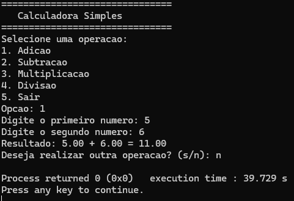

# Calculadora em C

Este projeto consiste em uma calculadora simples desenvolvida em linguagem C, executada via terminal (CLI).  
Ela permite realizar operações matemáticas básicas, sendo ideal para fins educacionais e prática de programação em C.


---

## 📸 Demonstração

A imagem abaixo mostra a calculadora sendo executada no terminal:



---

## ⚙️ Instalação e Pré-requisitos

### Pré-requisitos
- Compilador C (GCC recomendado)
- Sistema operacional Windows, Linux ou macOS

### Compilação
Para compilar o projeto, execute:

```bash
gcc src/calculadora.c -o calculadora
